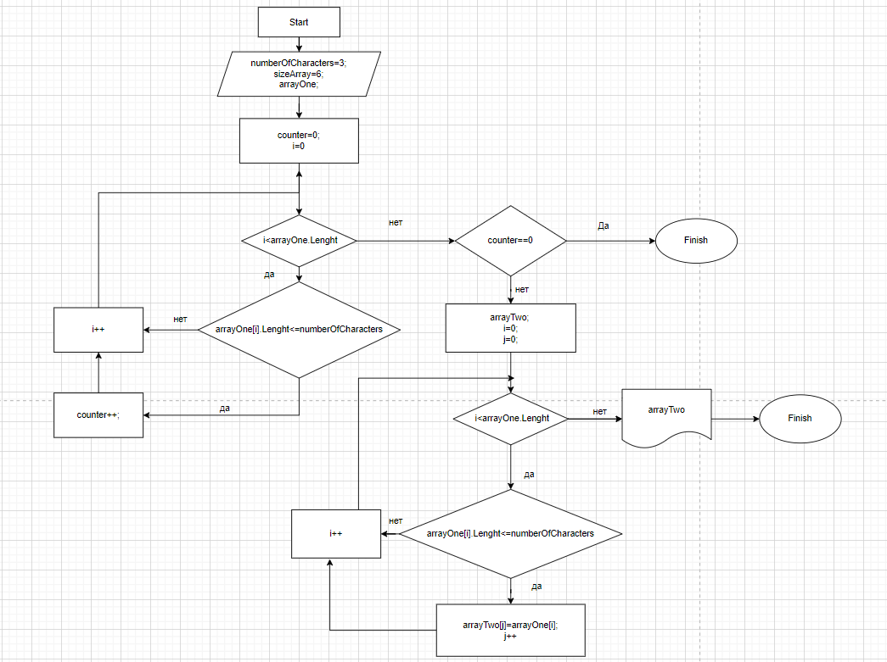

# Итоговая работа

## Задача:

Написать программу, которая из имеющегося массива строк формирует новый массив из строк, длина которых меньше, либо равна 3 символам. Первоначальный массив можно ввести с клавиатуры, либо задать на старте выполнения алгоритма. При решении не рекомендуется пользоваться коллекциями, лучше обойтись исключительно массивами.

## Алгоритм решения:

1. Создали строковый массив.
2. Создали метод, заполняющий массив символами введенными пользователем.
3. Создали метот поэлементного вывода массива на экран.
4. Создали метод подсчета элементов, длина которых меньше или ровна 3 символам.
5. Создали условие окончания решения, если колличество элементов, длина которх меньше или ровна 3 символам, равняется 0.
6. Создали метод, заполняющий массив элементами, длина которых меньше или равна 3 символам, из первоначального массива в новый.
7. Вывели на экран новый массив.

## Дополнительная информация:

Добавили блок-схему алгоритма решения задачи.

